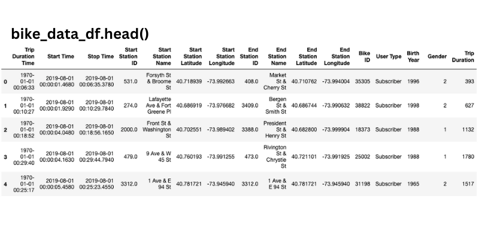
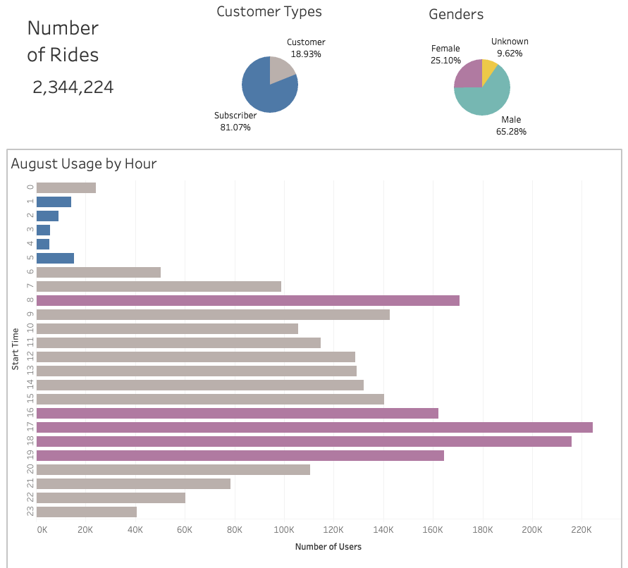
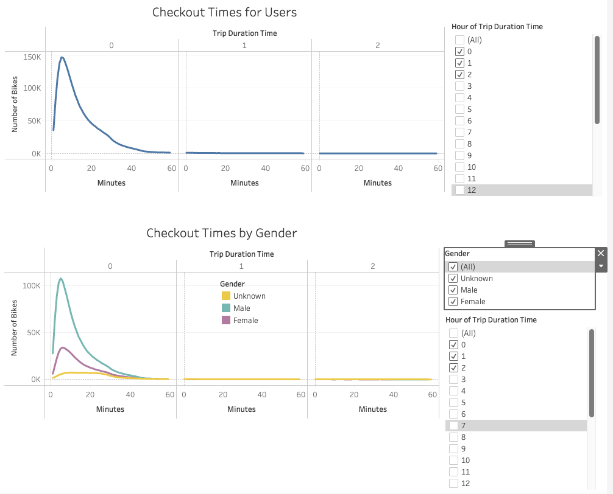
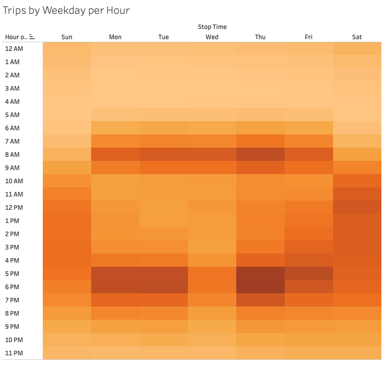
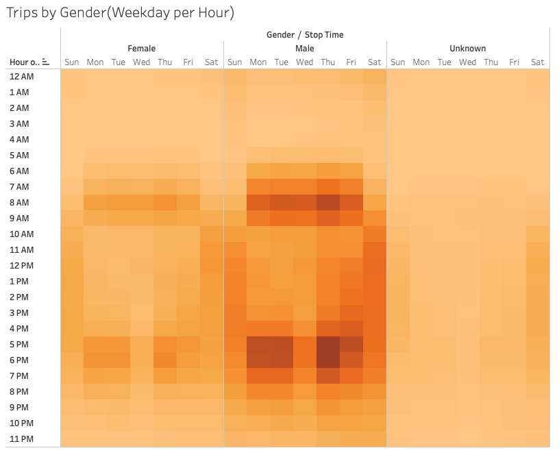
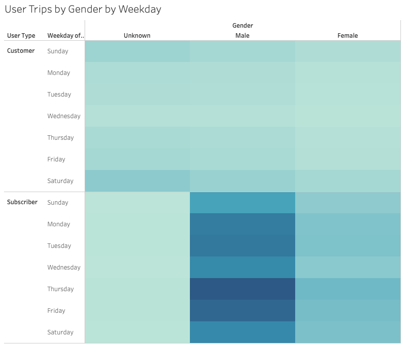
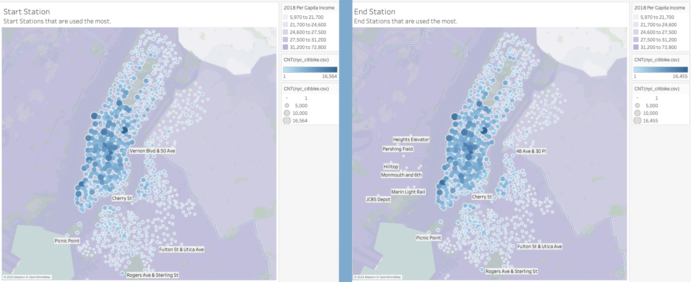
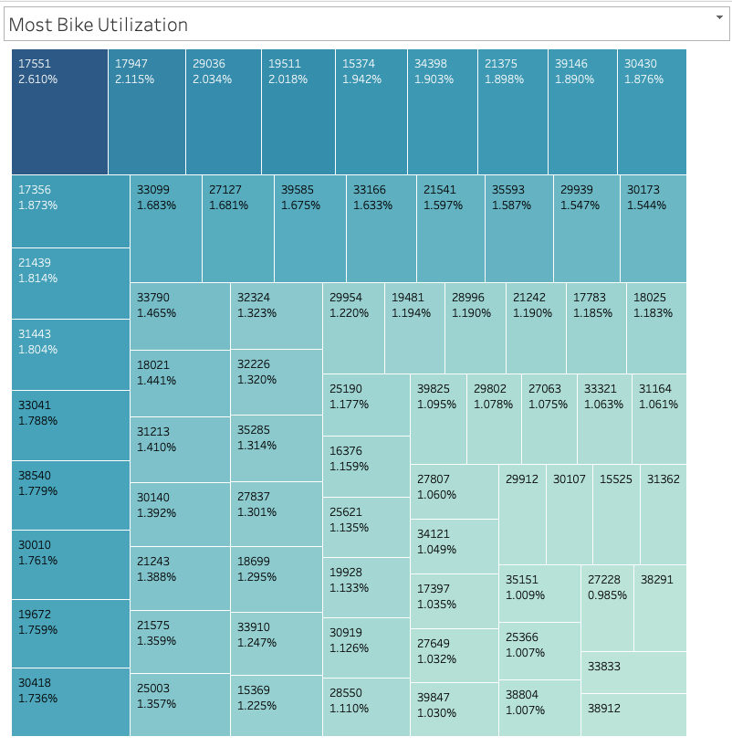

# bikesharing

## Overview 
This is an analysis on CitiBike data a bike sharing company, from August 2019. The goal is to understand a bit about the business data in order to put together a potential similar business in Des Moines, Iowa. The hope is that with the breakdown of this information we can better glean best practices and come up with great ideas for a new bike sharing business.

### Resources
- Data Sources: 
    - Citi bike System Data Repository – August 2019 
       - 201908-citibike-tripdata.csv.zip found here - https://www.citibikenyc.com/system-data
- Software:
    - Python 3.9.6 
    - Jupyter Notebook
    - Tableau 

## Results

### Generated Code, DataFram, and Tableau. 
- Tableau Story Link 
[https://public.tableau.com/views/NYC_Bike_Analysis_16783385402330/Story?:language=en-US&publish=yes&:display_count=n&:origin=viz_share_link](https://public.tableau.com/views/NYC_Bike_Analysis_16783385402330/Story?:language=en-US&publish=yes&:display_count=n&:origin=viz_share_link)
- Python Code 
    - [NYC_CitiBike_Challenge.ipynb](NYC_CitiBike_Challenge.ipynb)
        - This code augments the raw data to generate a clean datafeame that was then used to generate visualizations on Tableau.
- DataFrame Generated:
    - [https://drive.google.com/file/d/1uPbYFhi0iTfryIp0rlCcuW3rp6S1nYeG/view?usp=sharing](https://drive.google.com/file/d/1uPbYFhi0iTfryIp0rlCcuW3rp6S1nYeG/view?usp=sharing) 

### Summary of Findings 

In analyzing the whole data set we find that there are many useful conclusions we can draw to help make a business plan for a new bikeshare company in Iowa. The information I like to point out is around when and how the bike fleet could be maintained. We see that there are many bikes that are used more than others and that there are stations that are utilized more often the others. We also understand when peak hours are, during the 8am hour and from 4pm-8pm. The slowest hours are from 1am-6am. With this data we can make some important decisions that will help our bikes last and be properly maintained. 

The other big observation this data has led me to is that men are more apt to use bikes then women are and that it may be possible to have a special marketing plan based on this information. Add in when gender types are using the bikes most during the week, we can defiantly understand that Thursdays are likely to be a busy day. Specials could be run on Thursdays to capture more subscribers to the program. 

In conclusion there are lots of possibilities to find all kinds of information in this data set that can help. Furthermore, there is still data here we could glean. Usage by age could be useful and broken down in many different ways. Further breaking down how far people ride based on different subgroups like, age, user type, and from where they start and end their rides. 

## Visualizations 

### NYC CitiBike DataFrame Head Image 

[Images/NYC_CitiBike_df.png](Images/NYC_CitiBike_df.png)

### Tableau Generated Data Visualizations 

[Images/general_data.png](Images/general_data.png)
- We are analyzing data from New York City CitiBike data from August 2019. This slide shows the total number of rides taken in August with a breakdown of customer types; subscriber, or not, as well as gender. We also see a bar graph with when people used the bikes. This helps us understand when peak hours happen, in magenta, and when the slowest hours, in blue, occur. This helps us understand when peak hours happen, in magenta (during the 8am hour and 4pm-8pm), and when the slowest hours, in blue (from 1am-6am), occur.
------------------------------

[Images/checkout_time.png](Images/checkout_time.png)
- Checkout Time of Users and by Gender: Checkout time displayed for all users and by gender. In this slide we see the length of time that people have the bikes checked out. In the second graph we broke the data down by gender. These very clearly show that most rides are 5-7 minutes long.
-------------------------------            

[Images/trips_weekday_hour.png](Images/trips_weekday_hour.png)
- Trips by Weekday per Hour: This heat map depicts the busy times on average during a week. It shows that Thursday’s during peak hours are the busiest of the week. 
------------------------------

[Images/trips_gender_weekday_hour.png](Images/trips_gender_weekday_hour.png)
- Trips by Gender(Weekday per Hour): This heat map depicts the busy times on average during a week and breaks the data down by gender. It tells us many things but most notable is that woman use more on the weekends all day, outside peak hours during the week. Males use the most during peak hours on weekdays.  
------------------------------

[Images/user_trips_gender_weekday.png](Images/user_trips_gender_weekday.png)
- User Type Trips by Gender by Weekday: A heat map showing the usage by day of the subscriber’s vs the regular customers, and further broken down by gender. This helps us understand that the biggest user group are male subscribers and that we are more likely to know the gender if they are subscribers. 
------------------------------

[Images/maps.png](Images/maps.png)
- Station Usage Map:  These maps help us identify which stations are being used the most to start and end a ride. We see that Pershing Square North is used the most. 
 ------------------------------

[Images/all_usage.png](Images/all_usage.png)
- All Bike Utilization: All Bike ID numbers sorted by how often they are checked out. This visualization helps us understand that all the bikes are used at different rates and which ones are checked out the most.  
 ------------------------------

[Images/most_usage.png](Images/most_usage.png)
- Most Bike Usage: A zoom in on the bikes used most, measured by the total amount of time they have been checked out, which is depicted by the percentage of the whole fleet. We see here that there are about 70+ bikes that are used the most and will need maintenance more often. 

