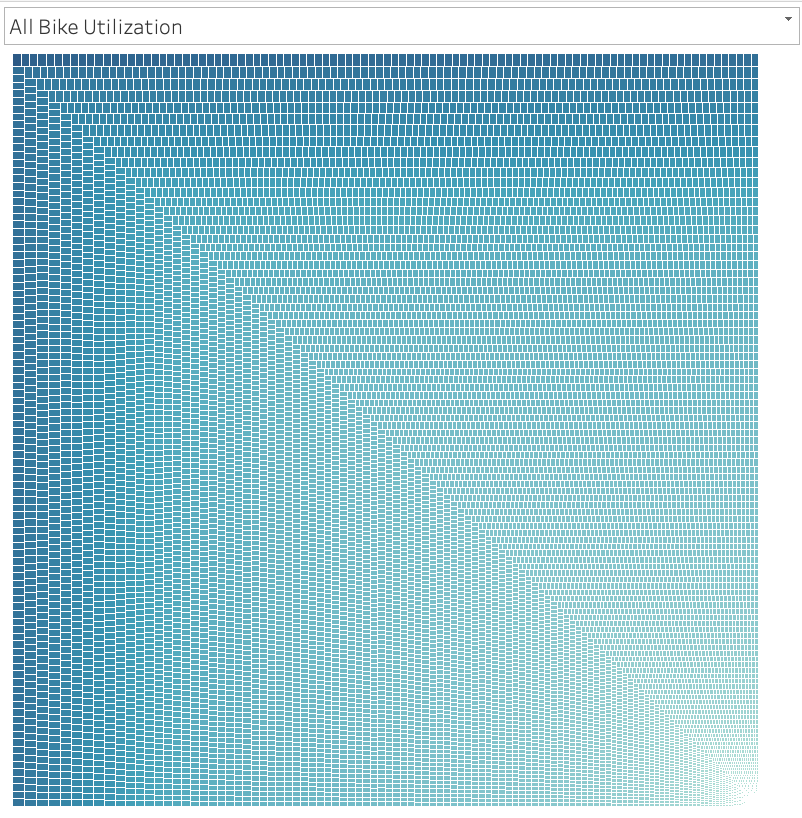

# bikesharing

## Overview 
This is an analysis on CitiBike data a bike sharing company, from August 2019. The goal is to understand a bit about the business data in order to put together a potential similar business in Des Moines, Iowa. The hope is that with the breakdown of this information we can better glean best practices and come up with great ideas for a new bike sharing business.

### Resources
- Data Sources: 
    - Citi bike System Data Repository – August 2019 
       - 201908-citibike-tripdata.csv.zip found here - https://www.citibikenyc.com/system-data
- Software:
    - Python 3.9.6 
    - Jupyter Notebook
    - Tableau 

## Results

### Generated Code, DataFram, and Tableau. 
- Tableau Story Link 
[https://public.tableau.com/views/NYC_Bike_Analysis_16783385402330/Story?:language=en-US&publish=yes&:display_count=n&:origin=viz_share_link](https://public.tableau.com/views/NYC_Bike_Analysis_16783385402330/Story?:language=en-US&publish=yes&:display_count=n&:origin=viz_share_link)
- Python Code 
    - [NYC_CitiBike_Challenge.ipynb](NYC_CitiBike_Challenge.ipynb)
        - This code augments the raw data to generate a clean datafeame that was then used to generate visualizations on Tableau.
- DataFrame Generated:
    - [https://drive.google.com/file/d/1uPbYFhi0iTfryIp0rlCcuW3rp6S1nYeG/view?usp=sharing](https://drive.google.com/file/d/1uPbYFhi0iTfryIp0rlCcuW3rp6S1nYeG/view?usp=sharing) 

### Summary of Findings 

## Visualizations 

### NYC CitiBike DataFrame Head Image 

- [Images/NYC_CitiBike_df.png](Images/NYC_CitiBike_df.png)

### Tableau Generated Data Visualizations 

- [Images/general_data.png](Images/general_data.png)
- We are analyzing data from New York City CitiBike data from August 2019. This slide shows the total number of rides taken in August with a breakdown of customer types; subscriber, or not, as well as gender. We also see a bar graph with when people used the bikes. This helps us understand when peak hours happen, in magenta, and when the slowest hours, in blue, occur. 
------------------------------

- [Images/checkout_time.png](Images/checkout_time.png)
- Checkout Time of Users and by Gender: Checkout time displayed for all users and by gender. In this slide we see the length of time that people have the bikes checked out. in the second graph we broke the data down by gender.  
-------------------------------            

- [Images/trips_weekday_hour.png](Images/trips_weekday_hour.png)
- Trips by Weekday per Hour: This heat map depicts the busy times on average during a week.
------------------------------

- [Images/trips_gender_weekday_hour.png](Images/trips_gender_weekday_hour.png)
- Trips by Gender(Weekday per Hour): This heat map depicts the busy times on average during a week and breaks the data down by gender. 
------------------------------

- [Images/user_trips_gender_weekday.png](Images/user_trips_gender_weekday.png)
- User Type Trips by Gender by Weekday: A heat map showing the subscribers vs the regular customers, and further broken down by gender. 
------------------------------

- [Images/maps.png](Images/maps.png)
- Station Usage Map:  These maps helps us identify which stations are being used the most to start and end a ride.
 ------------------------------

- [Images/all_usage.png](Images/all_usage.png)
- All Bike Utilization: All Bike ID numbers sorted by how often they are checked out.  
 ------------------------------

- [Images/most_usage.png](Images/most_usage.png)
- Most Bike Usage: A zoom in on the bikes used most, measured by the total amount of time they have been checked out, which is depicted by the percentage of the whole fleet. 

